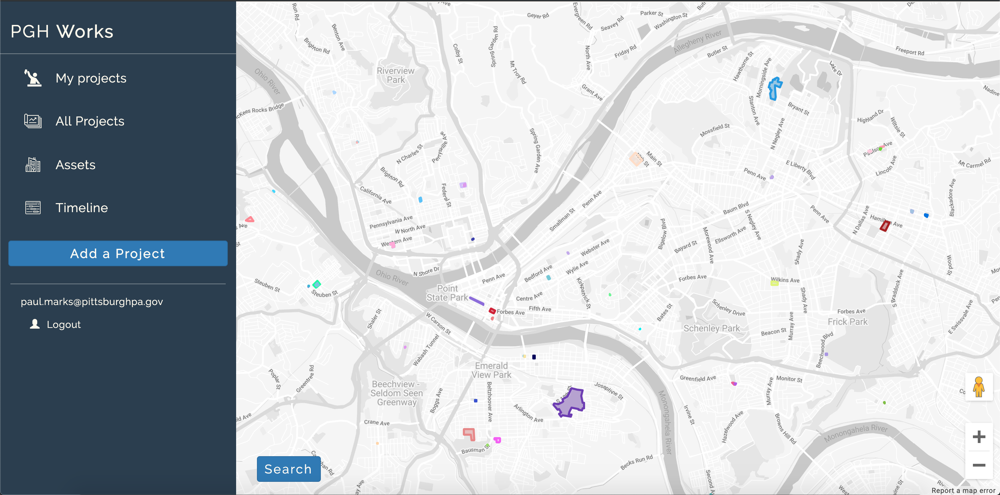

# PGH Works

PGH Works is used by the Department of Public Works and the Department of Mobility and Infrastructure at the City of Pittsburgh.  First and foremost, it was developed because there was no money left in the budget for project management software.  It was developed to meet a number of needs:
* Geolocate projects
* Define relationships between projects and assets (roads, facilities, bridges, etc)
* Define relationships between projects (historical or current)
* Provide a single source of truth for project data: duration, status, parties involved, etc.
* Standardize what a "project" is
* Call the Department's bluff on whether they had the organizational wherewithal to actually use project management software before shelling out millions of tax dollars

PGH Works interfaces directly with [Cartegraph](https://www.cartegraph.com/) as a backend.  While Cartegraph is not designed for project data or project management,  the hierarchical data structure it provides maps nicely to this type of application.  Within Cartegraph, "assets" are the top-level object, and each asset has a type (facility, bridge, road, etc), and a place (a set of coordinates).  Every asset can have an infinite number of "work orders" assigned to it.  And for every work order, there can be an infinite number of "tasks."  PGH Works co-opts this model by creating projects as assets, project phases as work orders, and milestones/subphases as tasks. 

PGH Works also interfaces with Sharepoint for a collection of users with edit privileges, and a table that serves as an application log.



## Why all the C#?

If you're looking at this you've probably noticed that it's the only web application I developed (and left) for the City of Pittsburgh that has a .net backend.  There are a few reasons for this: first, it's feckin fast.  PGH Works persists a ton of data from Cartegraph in state, and multiple threads just makes start up a lot faster.  Plus, I didn't want to bog down the Cartegraph [proxy service](https://github.com/CityofPittsburgh/cart-api) with all of the requests, thereby affecting performance for other applications interfacing with Cartegraph.

Second, in virtue of the ample mapping that occurs between Cartegraph and PGH Works, there are a couple of intensive methods that would serve as computational bottle necks in a single threaded environment.  For example, when importing the parks assets into state, each park needs redrawn as a single shape, as opposed to a collection of adjacent, free standing shapes.  I wouldn't want to do this on the fly with javascript:

```csharp
public static List<Points> GetConvexHull(List<Points> points)
{
    if (points == null)
        return null;

    if (points.Count() <= 1)
        return points;

    int n = points.Count(), k = 0;
    List<Points> H = new List<Points>(new Points[2 * n]);

    points.Sort((a, b) =>
        a.Lat == b.Lat ? a.Lng.CompareTo(b.Lng) : a.Lat.CompareTo(b.Lat));

    // Build lower hull
    for (int i = 0; i < n; ++i)
    {
        while (k >= 2 && cross(H[k - 2], H[k - 1], points[i]) <= 0)
            k--;
        H[k++] = points[i];
    }

    // Build upper hull
    for (int i = n - 2, t = k + 1; i >= 0; i--)
    {
        while (k >= t && cross(H[k - 2], H[k - 1], points[i]) <= 0)
            k--;
        H[k++] = points[i];
    }

    return H.Take(k - 1).ToList();
}
```
## Structure

### Client
    ...
    ├── ClientApp                                         
        ├── components        
            |── Account                 
            |── Cards                   # all cards for mapping collections to the UI
            |── DeleteConfirmations     # "Sure you want to delete {x}?"
            |── Filters                 # data filters for collections
            |── FormElements            # reusable form components
            |── Inputs                  # forms for post/put of objects
            |── Lists                   # collections of projects/assets
            |── Maps                    # all map interfaces
            |── Reports                 # all "report" components: project, phase, etc.
            |── Timeline                # add things to a timeline, inspect overlaps
            |── Utilities               # misc UX
            Home.tsx                    # loads store, returns map of projects
            Layout.tsx
            NavMenu.tsx
        |── css
        |── functions
        |── store
            |── GETS                    # stores all constant data
            activity.ts                 # projects can have "activity"...basically a chat room per project
            milestones.ts               # phases can have "milestones"
            phases.ts                   # projects can have "phases"
            projects.ts                 # top level object
            subphases.ts                # phases can have "subphases"
            tags.ts                     # every object (project, bridge, phase) can be tagged to another
            tasks.ts                    # every phase can have "tasks"
            timeline.ts                 # stores temporal objects that have been added to the timeline
                                            # (not persisted between sessions)

### Server
    ...
    ├── Controllers                 
        Account.cs              # Handles the auth flow
        Activity.cs             # All gets/posts/puts/deletes on activity class
        Home.cs                 # Returns client app
        Log.cs                  # Log posts to Sharepoint table
        Milestones.cs           # All gets/posts/puts/deletes for milestone class
        Personnel.cs            # Loads table of personnel from Sharepoint
        Phases.cs               # All gets/posts/puts/deletes for phase class
        Ping.cs                 # Heartbeat method...called from client to make sure user is still logged in
        Projects.cs             # All gets/posts/puts/deletes for project class
        Subphases.cs            # All gets/posts/puts/deletes for subphase class
        TaggableAssets.cs       # Imports all assets in Cartegraph that could be "tagged" by a project/phase
        Tags.cs                 # Collection of all tags
        Tasks.cs                # All gets/posts/puts/deletes for task class
        User.cs                 # Returns user data
    ├── Models                  # Data models and mappings ("Cg{x} -> {x}" == Cartegraph -> PGH Works)
    ├── Views                   # Server rendered pages         
    ├── wwwroot                 # Static assets 
    Program.cs                  # Entry point
    Startup.cs                  # Middleware

## Running Locally

### Prerequisites

* [.Net Core](https://docs.microsoft.com/en-us/dotnet/core/) - C# runtime
* [Node.js](https://nodejs.org) - JS runtime
* .env - See .env.example for all required secrets

### Installation
```
git clone https://github.com/CityofPittsburgh/pgh-works
cd pgh-works
// first, install dependencies for the server
dotnet restore
// then, install dependencies for the client
npm install
// run it
dotnet run
```

## Deployment

Both staging and production services are hosted in Azure.  Application is deployed directly from github, and can be triggered either (a) through the Azure GUI, (b) through the [CLI](https://docs.microsoft.com/en-us/cli/azure/webapp/deployment/source?view=azure-cli-latest#az-webapp-deployment-source-sync), or (c) through the [proxy service](https://github.com/CityofPittsburgh/azure-proxy).

For complete documentation on the azure environment, see [here](https://github.com/CityofPittsburgh/all-things-azure.git).

## License

This project is licensed under the MIT License - see the [LICENSE.md](LICENSE.md) file for details